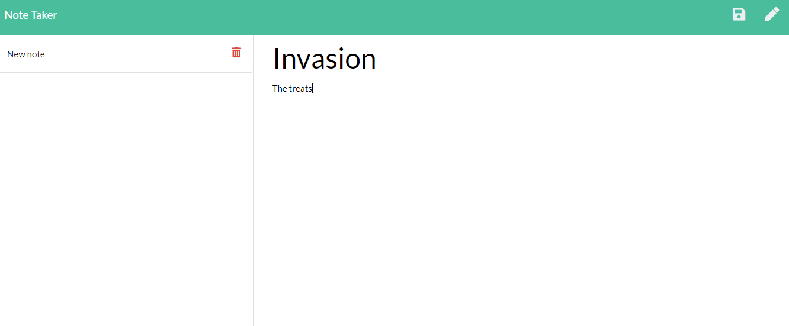
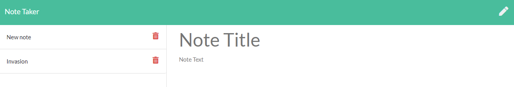

## Note taker

## Application

https://note-taker30303030.herokuapp.com/

## Description

An application to be able to write and save notes. From small business owners to cats who secretly own the house, organize your thoughts and keep track of tasks.

## Contributing

There are many ways in which you can participate in the project, for example: 
* Submit bugs and feature requests to the email below, and help us verify as they are checked in 
* Review source code changes
* Review the documentation and make pull requests for anything from typos to new content

## Questions

For any additional questions see my [GitHub profile](http://github.com/tylerpetri) or contact tylerpetri@hotmail.com